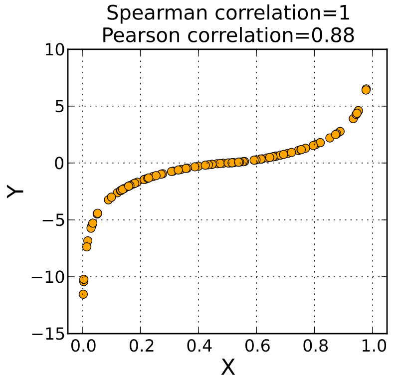

# Associações não-lineares 

 + Imaginem um experimento de química, em que as variáveis sejam 
a concentração de substrato (mg/L) e a velocidade de reação (mg/min.L).

 + Os dados ilustrativos seguem abaixo: 
 
```{r}
x <- c(0.1, 0.5, 1, 2, 4, 8, 16)
y <- c(0.1, 0.4, 0.8, 1.4, 2, 2.34, 2.45)
df2 <- data.frame(x, y)  
```

 + O gráfico dos resultados do experimento está dispoto a seguir
 
```{r}
plot(df2$x, df2$y, xlab = "Reagente", ylab = "Velocidade", 
     cex = 1.3, pch =19, type = "b", cex.lab =1.5) 
``` 
 
# Coeficiente de Spearman ($\rho$)

  + Para relações não-lineares o coeficiente de Pearson é inadequado
  
  + O coeficiente de Spearman mede a correlação entre postos (ranks)   
  + Se as observações apresentam uma relação perfeita, eu espero que: 
   - o menor valor de x esteja com o menor valor de y; 
   
   - o 2º menor valor de x esteja com o 2º menor valor de y; 
   
   - e, assim, por diante ...
   
   
   
   
 + Agora vamos cacular a correlação de Spearman no R
 
```{r}
cor(df2$x, df2$y, method = "spearman")
```

Para o nosso banco de dados, a correlação de Spearman é perfeita. Isso significa que a velocidade de reação e a quantidade de reagentes são perfeitamentes relacionados através de uma curva monótona.

No caso, a associação é positiva (curva crescente). 

+ Teste para a correlação de Spearman

```{r}
cor.test(df2$x, df2$y, method = "spearman")
```


 
 
 
 
 
 
 
   
   
  

